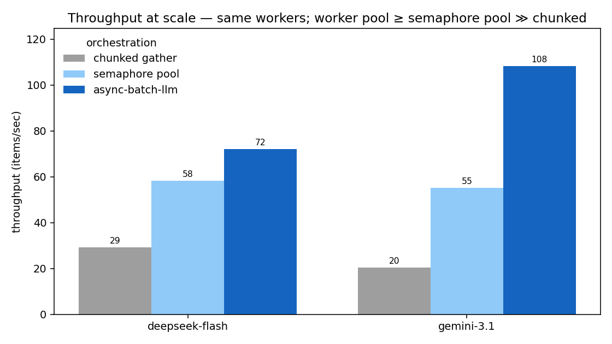
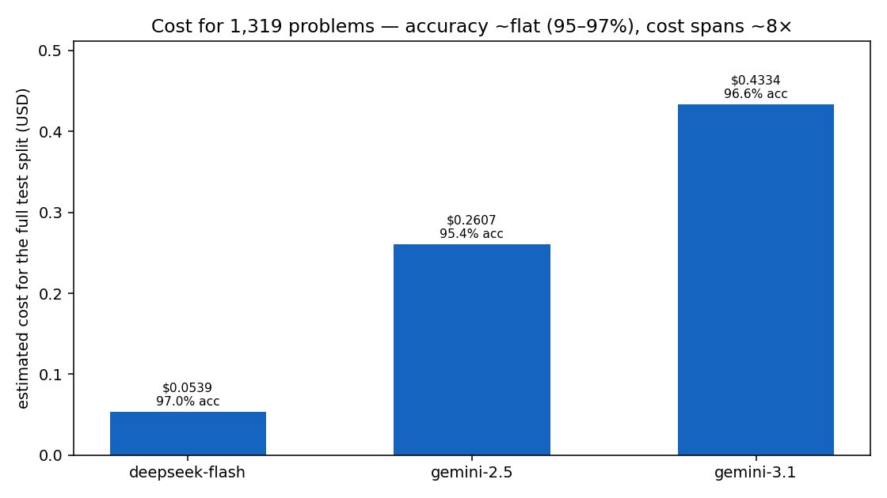

# Benchmarks

Real end-to-end numbers from the GSM8K bulk benchmark
(`examples/example_batch_benchmark.py`). For *how* it's built — the escalation
strategy, the classifier pitfall, gzip streaming, the judge — see the
[Benchmark Walkthrough](examples/benchmark-walkthrough.md).

!!! note "Reproducibility"
    Numbers shift run-to-run with network latency, model sampling, and your
    account's rate limits — treat them as illustrative, not a spec. Every table
    here is dumped to a machine-readable
    [`summary.json`](assets/benchmark-summary.json) /
    [`throughput.json`](assets/benchmark-throughput.json) so a run can be cited
    (and the charts regenerated) without re-running it.

## Methodology

| Field | Value |
| --- | --- |
| Date | 2026-06-10 |
| `async-batch-llm` version | 0.12.0 |
| Dataset | GSM8K **test split**, 1,319 problems |
| Models | `deepseek-v4-flash`, `gemini-3.1-flash-lite`, `gemini-2.5-flash-lite`; judge `gpt-5-nano` |
| Worker pools | DeepSeek 250, Gemini 3.1 250, **Gemini 2.5 Flash-Lite 5** (throttle-capped — 503s/rate-limits even at 10) |
| Pricing snapshot | 2026-06-01 (USD/Mtok; confirm against each provider's current page) |
| Hardware/network | single client host; results bounded by provider latency, not local CPU |

**Estimated cost to reproduce:** ~**$1–2** total in API spend (full 1,319-item
bake-off across three providers + a 1,000-item throughput run + a handful of
judge calls), plus ~25–30 minutes of wall time — dominated by the sequential
race leg, the 60s inter-leg throughput pauses, and Gemini 2.5's ~21-minute
bake-off at its 5-worker ceiling.

## Wall-time race

The same 30-item workload run three ways per provider — a one-at-a-time
sequential loop, a naive `asyncio.gather`, and async-batch-llm — to show how much
concurrency collapses wall time.


| Provider | Workers | Sequential (s) | `gather` (s) | async-batch-llm (s) | Speedup (seq→abl) |
| --- | ---: | ---: | ---: | ---: | ---: |
| deepseek-flash | 250 | 65.0 | 5.0 | 4.2 | 15.6× |
| gemini-3.1 | 250 | 39.1 | 2.6 | 2.1 | 19.1× |
| gemini-2.5 | 5 | 40.6 | 2.9 | 8.1 | 5.0× |

Concurrency collapses wall time (≈16–19× on the unthrottled providers). The race
runs only 30 items, so a 250-worker pool never fills — every call fires at once
regardless of orchestration, which is why `gather` and async-batch-llm are
neck-and-neck here. Gemini 2.5 is the exception: at its 5-worker cap (plus a few
transient 503s retried with backoff) it can't fire all 30 at once, so its `abl`
leg trails `gather` — that's the throttle ceiling, not orchestration overhead.
The pool's real advantage shows up at scale, below.

## Throughput at scale

To see what the worker pool buys you once it *does* fill, `--throughput` runs a
large batch (1,000 items) three ways at the **same** concurrency: a chunked
`asyncio.gather` (per-chunk barriers), a semaphore-bounded `gather` (continuous
refill — the fair hand-rolled baseline), and async-batch-llm.



| Provider | Workers | chunked gather (it/s) | semaphore pool (it/s) | async-batch-llm (it/s) | RL hits (g / s / a) |
| --- | ---: | ---: | ---: | ---: | :---: |
| deepseek-flash | 250 | 29.3 | 58.4 | **72.1** | 0 / 0 / 0 |
| gemini-3.1 | 250 | 20.4 | 55.2 | **108.4** | 0 / 0 / 0 |

With **zero** rate limits on any leg (`RL = 0`), this is a clean comparison — and
async-batch-llm comes out **ahead of even the fair semaphore pool** (≈1.2× on
DeepSeek, ≈2× on Gemini 3.1), with the chunked baseline trailing both. Why the
worker pool wins: a `Semaphore`-over-`gather` still *schedules all 1,000
coroutines up front* and lets them contend on the semaphore, whereas the worker
pool runs a fixed N tasks pulling from a bounded queue — fewer tasks, less
event-loop churn, and backpressure for free. It's the optimized version of the
pattern you'd otherwise hand-roll.

!!! warning "Read the multiple with a grain of salt"
    The legs run back-to-back (with a 60s gap to reset quota), so connection
    warmth and ordering can move the exact ratio. The robust takeaway is the
    *direction*: the bounded worker pool is at least as fast as a fair semaphore
    pool, and the chunked-barrier baseline is the one that actually loses. And
    against a provider that throttles you, the framework is the only leg that
    survives it (the `RL` columns) rather than shedding results.

## Provider bake-off

Same framework, one strategy swap per provider, over the full test split.



| Provider (model) | Accuracy | Wall (s) | Input | Cached | Output | Avg out/item | Cost ($) |
| --- | ---: | ---: | ---: | ---: | ---: | ---: | ---: |
| deepseek-flash (`deepseek-v4-flash`) | 97.0% | 18.3 | 131,083 | 17,024 | 135,468 | 103 | **0.0539** |
| gemini-2.5 (`gemini-2.5-flash-lite`) | 95.4% | 1,293.2 | 133,759 | 0 | 618,428 | 469 | 0.2607 |
| gemini-3.1 (`gemini-3.1-flash-lite`) | 96.6% | 43.5 | 129,951 | 0 | 267,258 | 203 | 0.4334 |

**Accuracy is 95–97% across all three; cost spans ~8× ($0.054 → $0.43).** The
cost gap isn't only sticker price — it decomposes into three multiplicative
factors, all visible in the table:

1. **Output price/token** — DeepSeek's output rate ($0.28/Mtok) is the lowest here.
2. **Output *length*** — DeepSeek is dramatically terser: **103** output
   tokens/item vs Gemini 2.5's **469** and Gemini 3.1's **203**, for the *same*
   accuracy. Fewer tokens, same answer (see below).
3. **Caching** — DeepSeek is the only provider with cache hits in this workload
   (**13%**), and its discount is steeper (`CachedTokenRates.DEEPSEEK` = 2% of
   normal input vs Gemini's 10%).

### Terse vs. verbose: same answer, very different bills

> *James decides to run 3 sprints 3 times a week. He runs 60 meters each sprint.
> How many total meters does he run a week?* (gold: **540**)

**DeepSeek — 57 output tokens:**

```text
He runs 3 sprints per session, each 60 meters, so per session that's 3 × 60 = 180 meters.
He does this 3 times a week, so total per week is 180 × 3 = 540 meters.

#### 540
```

**Gemini 2.5 Flash-Lite — 185 output tokens (3.2× more, identical answer):**

```text
Here's how to solve the problem step-by-step:

1.  **Meters per sprint:** James runs 60 meters per sprint.
2.  **Sprints per session:** He runs 3 sprints each time he exercises.
3.  **Meters per session:** ... 60 meters/sprint * 3 sprints/session = 180 meters/session.
4.  **Sessions per week:** He exercises 3 times a week.
5.  **Total meters per week:** ... 180 meters/session * 3 sessions/week = 540 meters/week.

#### 540
```

Across the bake-off that ~3–5× verbosity multiplier — not the per-token price —
is the largest single driver of Gemini 2.5's cost over DeepSeek.

## Error & retry resilience

The same run, counting what the framework *absorbed*:

- **deepseek-flash** — 97.0%, **0 permanent errors, 0 items reaching the judge**.
  1,328 attempts (9 retries, 2 thinking escalations); 9 `AnswerParseError`
  occurrences, all recovered on retry. Only provider with cache hits (13%).
- **gemini-3.1** — 96.6%, a clean run: 1,319 attempts, **0 retries, 0
  escalations, 0 errors**.
- **gemini-2.5** — 95.4% over a rough session at its 5-worker ceiling: 1,439
  attempts (**120 retries, 41 escalations**), with exception occurrences (across
  attempts, incl. recovered) of `AnswerParseError=36, FrameworkTimeoutError=29,
  ServerError=57`. Transient 503s are now retried per-item with backoff (not a
  global cooldown); the framework absorbed the churn and still landed 95.4% with
  exactly **1** output reaching the fallback judge. A bare `gather` would have
  dropped every one of those 503s/timeouts as lost results.

The LLM-as-judge fired on exactly the 1 item the free regex grader couldn't parse.

## Caveats

- **Worker counts differ**, so "Wall (s)" in the bake-off is **not** an
  apples-to-apples speed race — Gemini 2.5 runs at 5 workers (its rate-limit
  ceiling — hence the ~21-minute wall), the others at 250. Worker count doesn't
  affect accuracy/token/cost.
- **The two Gemini fast passes aren't a matched "no-thinking" setup** (2.5's
  `budget=0` is fully off; 3.1's `minimal` still thinks a little) — don't read
  the 3.1-vs-2.5 accuracy gap as pure model quality.
- **The throughput multiple has ordering/warmth caveats** (see the warning
  above); the direction (worker pool ≥ semaphore pool ≫ chunked) is the point.

## Choosing a provider: beyond cost

Cost and accuracy are the easy axes; for production the **data-governance** delta
often matters more, and can swing the decision regardless of price. The framework
makes the swap a one-liner, so pick on what actually matters to you. **Verify
each provider's *current* terms — these move.**

| Axis | DeepSeek (direct API) | Google (Gemini API / Vertex AI) |
| --- | --- | --- |
| Primary jurisdiction | China | US-based; Vertex offers data-residency regions |
| Train-on-your-API-data default | Verify current ToS; consumer terms have historically been permissive | Paid API/Vertex: not used to train models (per Google's terms) |
| Compliance certifications | Verify | SOC 2 / ISO / HIPAA / GDPR posture via Google Cloud / Vertex |
| Enterprise controls (VPC, audit, DPA) | Limited on the direct API | Available via Vertex AI / Google Cloud |
| Regulatory exposure | Some governments restrict DeepSeek for official use | Widely enterprise-approved |

This table is a *starting checklist*, not legal advice or a current statement of
any provider's policy — confirm against the live terms and your own compliance
requirements before committing a workload.

---

*Tables and charts are generated from the committed
[`benchmark-summary.json`](assets/benchmark-summary.json) and
[`benchmark-throughput.json`](assets/benchmark-throughput.json); regenerate the
charts with `python examples/generate_benchmark_charts.py`.*
