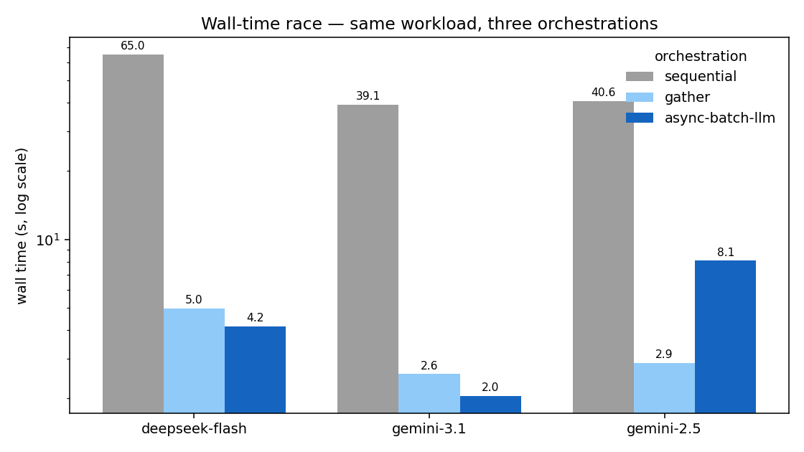

# Benchmarks

Real end-to-end numbers from the GSM8K bulk benchmark
(`examples/example_batch_benchmark.py`). For *how* it's built — the escalation
strategy, the classifier pitfall, gzip streaming, the judge — see the
[Benchmark Walkthrough](examples/benchmark-walkthrough.md).

!!! note "Reproducibility"
    Numbers shift run-to-run with network latency, model sampling, and your
    account's rate limits — treat them as illustrative, not a spec. Every table
    here is dumped to a machine-readable
    [`summary.json`](assets/benchmark-summary.json) /
    [`throughput.json`](assets/benchmark-throughput.json) so a run can be cited
    (and the charts regenerated) without re-running it.

## Methodology

<!-- TODO(refresh): values below are from the representative run; update from
     benchmark_results/summary.json["methodology"] after the next run. -->

| Field | Value |
| --- | --- |
| Date | 2026-06-09 |
| `async-batch-llm` version | 0.12.0 |
| Dataset | GSM8K **test split**, 1,319 problems |
| Models | `deepseek-v4-flash`, `gemini-3.1-flash-lite`, `gemini-2.5-flash-lite`; judge `gpt-5-nano` |
| Worker pools | DeepSeek 250, Gemini 3.1 250, **Gemini 2.5 Flash-Lite 5** (throttle-capped — 503s/rate-limits even at 10) |
| Pricing snapshot | 2026-06-01 (USD/Mtok; confirm against each provider's current page) |
| Hardware/network | single client host; results bounded by provider latency, not local CPU |

**Estimated cost to reproduce:** ~**$1–2** total in API spend (full 1,319-item
bake-off across three providers + a 1,000-item throughput run + a handful of
judge calls), plus ~10–20 minutes of wall time (the sequential race leg and the
60s inter-leg throughput pauses dominate).

## Throughput at scale

The differentiator is **not** raw speed — a well-tuned `asyncio.gather` pool
already saturates a provider. The point of this table is to show the framework
**matches** that fair baseline while the *chunked* baseline (per-chunk barriers)
trails, and while the framework alone survives the errors a bare pool drops.

<!-- TODO(refresh): from benchmark_results/throughput.json -->

| Provider | Workers | chunked gather (it/s) | semaphore pool (it/s) | async-batch-llm (it/s) | RL hits (g / s / a) |
| --- | ---: | ---: | ---: | ---: | :---: |
| deepseek-flash | 250 | 28.4 | *tbd* | 57.2 | 0 / 0 / 0 |
| gemini-3.1 | 250 | 38.7 | *tbd* | 49.8 | 0 / 0 / 0 |

Read the **RL** columns first: a bare `gather`/semaphore pool has no backoff, so
a 429/503 is a silently lost result; the framework retries, pauses, and
slow-starts. Expect `a ≈ s` on raw throughput (parity) — the chunked-gather gap
(`g`) is the per-chunk-barrier tax, not the framework's edge.

## Provider bake-off

Same framework, one strategy swap per provider, over the full test split.

<!-- TODO(refresh): from benchmark_results/summary.json["bakeoff"] -->

| Provider (model) | Accuracy | Wall (s) | Input | Cached | Output | Avg out/item | Cost ($) |
| --- | ---: | ---: | ---: | ---: | ---: | ---: | ---: |
| deepseek-flash (`deepseek-v4-flash`) | 96.9% | 28.6 | 130,171 | 16,896 | 136,127 | ~103 | 0.0540 |
| gemini-3.1 (`gemini-3.1-flash-lite`) | 96.6% | 16.1 | 129,951 | 0 | 267,258 | ~203 | 0.4334 |
| gemini-2.5 (`gemini-2.5-flash-lite`) | 95.3% | *tbd* | 129,748 | 0 | 443,609 | ~336 | 0.1904 |

**Accuracy is ~95–97% across all three; cost spans ~8×.** The cost gap isn't only
sticker price — it decomposes into three multiplicative factors:

1. **Output price/token** — DeepSeek's output rate is the lowest here.
2. **Output *length*** — DeepSeek is dramatically terser (≈103 output tokens/item
   vs Gemini 2.5's ≈336) for the same accuracy. Fewer tokens, same answer.
3. **Caching** — DeepSeek is the only provider with cache hits in this workload
   (≈13%), and its cache discount is steeper
   (`CachedTokenRates.DEEPSEEK` = 2% of normal input vs Gemini's 10%).

### Terse vs. verbose: same answer, very different bills

<!-- TODO(refresh): paste one shared item from summary.json["samples"], showing
     each provider's raw reasoning + output_tokens side by side. -->

> *Placeholder — one GSM8K problem, answered correctly by every provider, with
> each provider's full reasoning and output-token count, to make the
> length-vs-cost story concrete. Populated from `summary.json["samples"]`.*

## Error & retry resilience

This is where the framework earns its keep — the same run, but counting what it
*absorbed*:

<!-- TODO(refresh): from summary.json["bakeoff"][*].{attempts,retries,escalations,error_counts} -->

- **deepseek-flash** — 1,278/1,319 correct, **0 permanent errors**; 1,328
  attempts (9 retries, 2 thinking escalations, 9 malformed outputs). Only
  provider with cache hits.
- **gemini-3.1** — 1,274 correct, a clean run: **0 retries, 0 escalations, 0
  errors**.
- **gemini-2.5** — 1,257 correct over a rough session: 1,383 attempts (**64
  retries**, 32 escalations); `error_counts` `AnswerParseError=36,
  FrameworkTimeoutError=29`, ending with 1 unparsed + a couple of permanent
  failures. Transient 503s are now retried per-item with backoff (not a global
  cooldown). The framework absorbed all of it; a bare `gather` would have shed
  those calls.

The LLM-as-judge fired on exactly the items the free regex grader couldn't parse.

## Caveats

- **Worker counts differ**, so "Wall (s)" in the bake-off is **not** an
  apples-to-apples speed race — Gemini 2.5 runs at 5 workers (its rate-limit
  ceiling), the others at 250. Worker count doesn't affect accuracy/token/cost.
- **The two Gemini fast passes aren't a matched "no-thinking" setup** (2.5's
  `budget=0` is fully off; 3.1's `minimal` still thinks a little) — don't read
  the 3.1-vs-2.5 accuracy gap as pure model quality.
- **Throughput parity holds below the rate ceiling.** Against a provider that
  throttles you, the framework leg can look *slower* purely because it's the one
  respecting the limit — read the `RL` columns.

## Choosing a provider: beyond cost

Cost and accuracy are the easy axes; for production the **data-governance** delta
often matters more, and can swing the decision regardless of price. The framework
makes the swap a one-liner, so pick on what actually matters to you. **Verify
each provider's *current* terms — these move.**

| Axis | DeepSeek (direct API) | Google (Gemini API / Vertex AI) |
| --- | --- | --- |
| Primary jurisdiction | China | US-based; Vertex offers data-residency regions |
| Train-on-your-API-data default | Verify current ToS; consumer terms have historically been permissive | Paid API/Vertex: not used to train models (per Google's terms) |
| Compliance certifications | Verify | SOC 2 / ISO / HIPAA / GDPR posture via Google Cloud / Vertex |
| Enterprise controls (VPC, audit, DPA) | Limited on the direct API | Available via Vertex AI / Google Cloud |
| Regulatory exposure | Some governments restrict DeepSeek for official use | Widely enterprise-approved |

This table is a *starting checklist*, not legal advice or a current statement of
any provider's policy — confirm against the live terms and your own compliance
requirements before committing a workload.

---

*Tables and charts are generated from the committed
[`benchmark-summary.json`](assets/benchmark-summary.json) and
[`benchmark-throughput.json`](assets/benchmark-throughput.json); regenerate the
charts with `python examples/generate_benchmark_charts.py`.*
